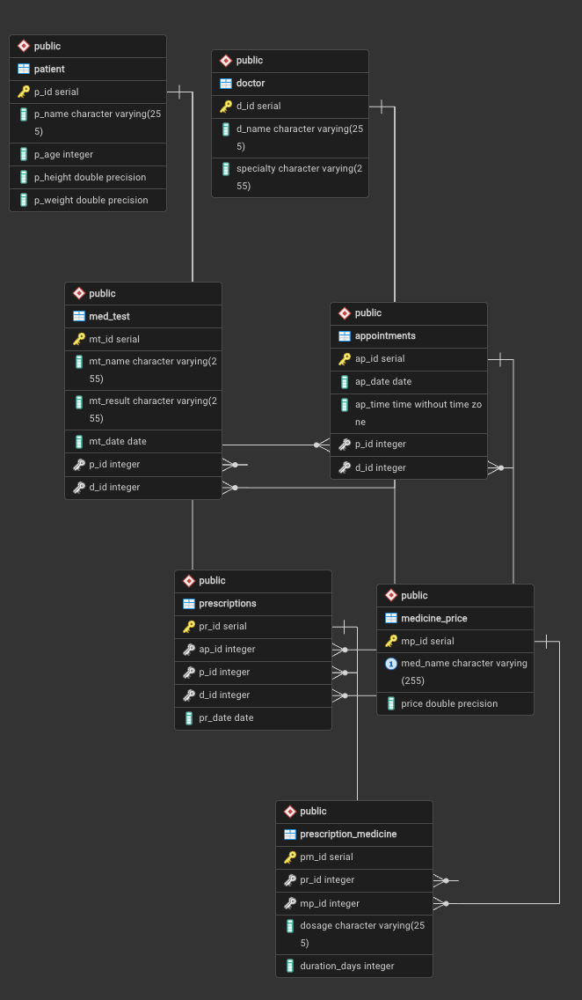

# Hospital Medical Database


---

**Course:** CS377.<br>
**Author:** Karthik Reddy Akkala.<br>
**Date:** May 2, 2026. 

---

## Introduction: 
This project is for implementing a PostgreSQL based hospital management database for managing patients, medical test, and all other records.

This has been containerized with docker for easy setup and working efficiently across different environoments.

---

## Tools:
- PostgreSQL
- Docker

---

## Project Structure: 

```
CS377-A_hospital_medicaldb/
├── README.md
├── database
│   ├── backups
│   │   └── backup.sql
│   └── init. 
│       ├── schema.sql
│       └── seed.sql
├── docker-compose.yml
├── queries
│   ├── function.sql
│   ├── procedures.sql
│   └── queries.sql
└── scripts
    └── backup_db.sh
```

---

## Setting Up Database:

Start & Connect To Database:

```bash
git clone https://github.com/karthik-bit1/CS377-A_hospital_medicaldb.git

cd CS377-A_hospital_medicaldb

docker compose up -d

docker exec -it hospital_postgres psql -U postgres -d hospital_meddb
```
Stop Database:

```bash
docker compose down
```

Reset Database:

```bash
docker compose down -v
docker compose up
```

---

## Backup Database:

Running Backups:
```bash
./scripts/backup_db.sh
```

Backups saved in:

```
CS377-A_hospital_medicaldb/
├── README.md
└── database
    └── backups
        └── backup.sql
```

---

## Tables In The Database:
- **patient**: stores patient information
- **doctor**: stores doctor details 
- **appointments**: tracks patients appointments with their doctor
- **med_test**: stores medical test results 
- **medicine_price**: stores medicine pricing
- **prescriptions**: records prescriptions issued 
- **prescription_medicine**: links prescriptions with medicines 

---

## ERD Diagram:

<p align="center">  </p>

---

## Sample Queries:

```sql
SELECT * FROM patient;
SELECT * FROM doctor;
SELECT * FROM appointments;
SELECT * FROM med_test;
SELECT * FROM medicine_price;
SELECT * FROM prescriptions;
SELECT * FROM prescription_medicine;

SELECT p.p_name, d.d_name, a.ap_date, a.ap_time
FROM appointments a
JOIN patient p ON p.p_id = a.p_id
JOIN doctor d ON d.d_id = a.d_id
ORDER BY p.p_name;

SELECT * FROM get_doctor_appointments(1);
SELECT * FROM get_patient_medical_history(1);
SELECT * FROM get_patient_info(1);

-- Assuming there are records in med_test with mt_name = 'Blood Test' and mt_result = 'negative'
SELECT * FROM scan_reports('Blood Test', 'negative') ORDER BY mt_id; 
-- Assuming pr_id = 1 exists in prescriptions table
SELECT * FROM get_prescription_details(1);
```
